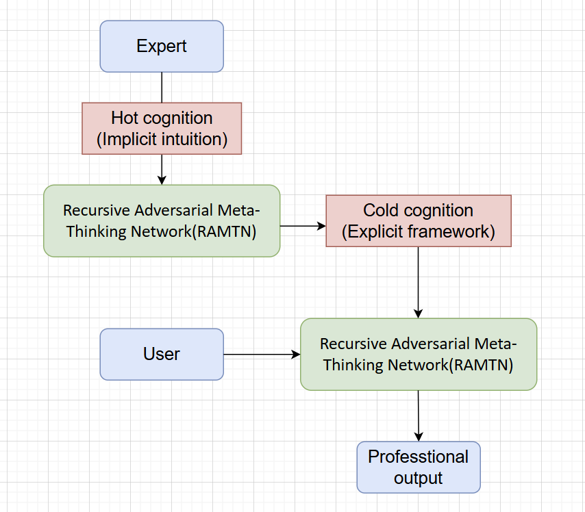
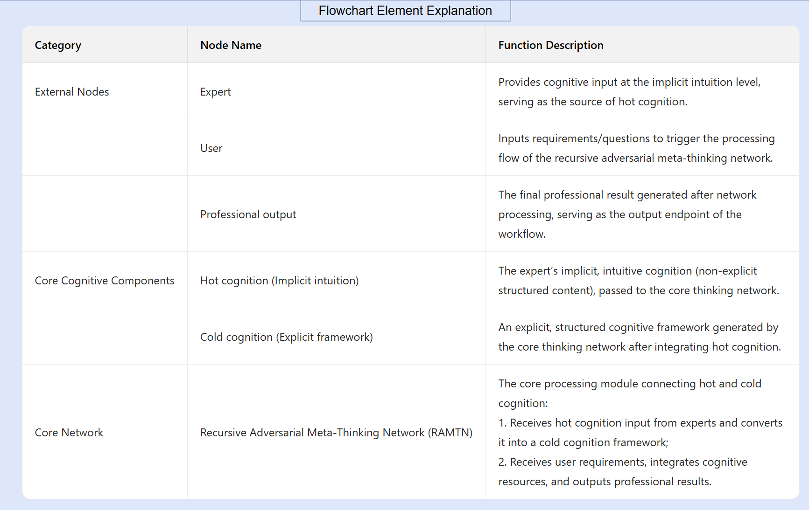
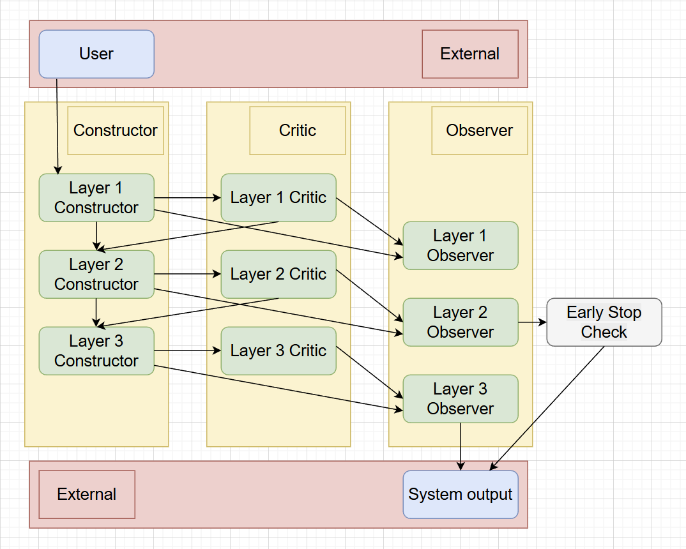
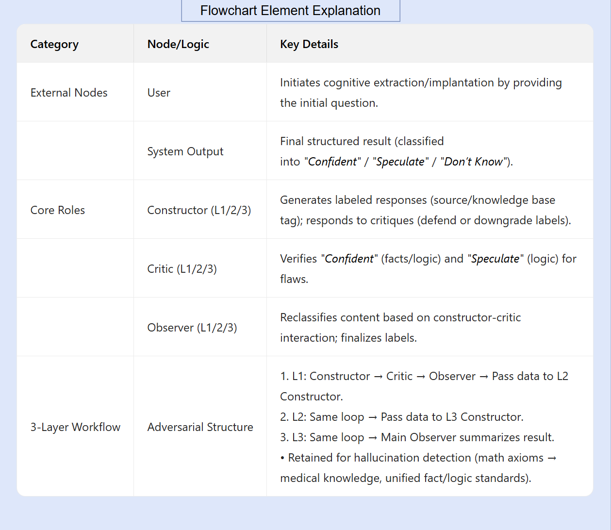

# Breaking the Black Box of AI and Human Experts: Pluggable Cognitive Frameworks for Human-machine Collaboration

>A story of independent exploration: This project was conceived and implemented independently by me as a sophomore in half a year, through deep meta-interactions with a large language model. After the release of DeepSeekMath-V2, I decided to open source this general cognitive architecture ahead of time in order to drive the paradigm revolution between humans and AI from "tools" to "partners".

>Urgent Release: In response to the recursive verification breakthrough of DeepSeekMath-V2, this proof-of-concept version was released early. The full documentation and use cases are being urgently refined, and the community is welcome to contribute!

## 🚀 Online Experience
This project has been deployed and is available for direct access at:http://101.200.137.245:8080

Version Note: Currently in Beta (v0.1), it is a functional prototype version, and details will continue to be refined.
Risk Warning: Due to the urgent release time, some code details have not been carefully reviewed, so it is recommended to only be tested in non-production environment.
Future Optimization Plans:
1.Complete full code detail review and logic verification;
2.Add new scene test cases to improve stability;
3.Improve the exception handling mechanism and boundary scenario adaptation;
4.Add more cognitive framework cases in vertical fields.

All contents will continue to be updated iteratively. If any problems are found, you can feedback through Issue. Thank you for your understanding and support.

## Summary

I propose a new paradigm called "human-machine collaborative cognitive augmentation" to address the fundamental gap between the cognitive black box of human experts (where implicit intuitions are hard to pass on) and the computational black box of AI (where decision-making processes cannot be trusted). Through structured meta-interactions, I distill human tacit knowledge into a computable and portable pluggable cognitive framework, enabling bidirectional cognitive augmentation. This work marks a key transition for AI from "tool" to "thought partner".

## Core Contributions

1. Meta-Interaction Methodology: A recursive process (Build-Questioned-Observe) that guides deep collaboration between humans and AI, aiming to systematically extract and solidify an individual's unique system of strategic decisions.

2. RAMTN Architecture: RAMTN (Recursive Adversarial Meta-Thinking Network) is a revolutionary cognitive architecture whose core innovation is a pluggable cognitive framework. It can both actively extract an intuitive decision-making model from expert conversations, and load and augment other individuals or systems with that model as a "thinking engine".

3. Proof of Validity of the Paradigm: The feasibility of the paradigm is initially verified by the founder's original practice of constructing a complete strategy system.

## Fundamental Differences from Existing Approaches
| Methods               | Essence                     | Limitations               |                                                 
|-------------------------------------|----------------------------------------------|----------------------------------------|
| Tips for Engineering      | Optimize the input to the black box | AI's passive tool role was not changed  |
| Chain of Thought      | Linear reasoning process display | Lack of recursive self-criticism and frame generation                        |
| AI Agents             | Action-oriented task execution               | Decision logic is still encapsulated in a black box                         |
| My Meta-Interactions | Role transition: AI becomes an active "partner" in framework generation and critique | The fundamental problem of cognition extraction and transplantation is solved |

 *Table 1: A tabular comparison of the essence and limitations between traditional AI-assisted methods and the meta-interaction approach*

## RAMTN Architecture Core

*Figure 1: Core input-process-output architecture of RAMTN, illustrating the cognitive framework-driven recursive thinking logic*

*Figure 2: Flowchart Element Explanation for Core input-process-output architecture of RAMTN*

RAMTN is a recursive adversarial meta-thinking network with the following core process:

Input:User question + an optional, loaded "expert cognitive framework".

Process:Guided by the framework, perform a multiple recursive Construction-Question-Observe loop.

Output:Structured analysis with three levels of confidence (I know for sure, I suspect, I don't know) to produce a trusted cognitive output.

Here's how RAMTN works:

*Figure 3: Three-layer Constructor-Questioner-Observer loop process of RAMTN, including intra-layer interaction and inter-layer data transmission logic*

*Figure 4: Flowchart Element Explanation for Three-layer Constructor-Questioner-Observer loop process of RAMTN*

RAMTN uses a three-layer Constructor-Questioner-Observer adversarial structure:

1.Process within each layer: Constructor generates responses labeled "sure/speculation/unknown" + source (demoting to "speculation" if knowledge is insufficient); The Questioner checks the "sure" facts/logic, the "speculative" logic; The Constructor needs to respond with the factual logic (failing to meet the criteria, the label will be downgraded), and finally the Observer will re-evaluate the classification.

2.Inter-layer flow: The content of the Constructor + Questioner of this layer is passed to the next layer Constructor and the Observer of this layer, completing the three layers of iteration.

3.Classification of results: "Convinced" needs to be agreed by both sides; "Speculative" if not all responses were accepted; "Unknown" is unable to prove/not responded.

4.Utility and Transfer: I transfer the adversarial mechanism of the original mathematical problem to the medical domain, using a unified fact/logic standard for hallucination detection, and output a structured classification result.

## A Note about DeepSeekMath-V2

I noticed that the recently released DeepSeekMath-V2 is a brilliant demonstration of the power of the "recursive self-verification" paradigm in its domain. I congratulate and am excited about it. DeepSeekMath-V2's "generator-verifier-meta-verifier" self-verification framework provides a paradigm for the procedural rigor of mathematical reasoning (Shao et al., 2025). The model iterates reasoning ability through automated loop closure, reaching gold level in IMO 2025. Its technical details may refer to the open source report (https://github.com/deepseek-ai/DeepSeek-Math-V2/blob/main/DeepSeekMath_V2.pdf).

I must point out:
The architectural design of this work (RAMTN) was formed independently from the core ideas, with an early exploration timestamp predating the release of DeepSeekMath-V2. Far from undercutting my work, the success of DeepSeek in mathematics strongly confirms the foresight and correctness of the path I have chosen.

Our goal is different: DeepSeekMath-V2 is a perfect example of this paradigm in closed mathematics. RAMTN, on the other hand, aims to build a general cognitive architecture to solve open, ambiguous human-level strategic decision problems.

## Conclusions and the Future

This work provides a technical foundation for breaking knowledge monopoly and realizing "cognitive equality". I have open sourced the RAMTN core engine and invited the community to explore its infinite possibilities in education, consulting, medical care and other fields together.

## References

1. Shao, Z., Luo, Y., Lu, C., Ren, Z.Z., Hu, J., Ye, T., Gou, Z., Ma, S., & Zhang, X. (2025). DeepSeekMath-V2: Towards Self-Verifiable Mathematical Reasoning. Open-source technical report. Retrieved from
https://github.com/deepseek-ai/DeepSeek-Math-V2/blob/main/DeepSeekMath_V2.pdf

## AI-Assisted Statement

AI tools (DeepSeek, Doubao) were used to improve efficiency during the development of this project. The specific collaboration methods are as follows:

• Code Level: The design of the core architecture and strategic cognitive framework of the project is controlled by human authors, the detailed implementation of the code (such as API call encapsulation, data parsing logic) is generated by AI, and all AI-generated code is verified by artificial logic and adapted to the architecture;

• Documentation Level: The first draft of README and related instructions are generated by AI and reviewed by human authors, adjusted in structure, supplemented in content, and verified for technical accuracy;

• Future Improvements: Due to the urgency of the release, code details and documentation will be continuously reviewed and refined in subsequent releases (the current version is in beta).

The final intellectual property of the project belongs to the human author, and the integrity, security, and functionality of all content are the ultimate responsibility of the human author.

## Demonstration case
### Case Demonstration: Buffett’s Investment Cognition Extraction & AI Healthcare Stock Strategy Implantation

This section presents a full operational example of the RAMTN architecture: we first use the strategic extraction mode to distill Buffett’s core decision logic from his See’s Candies investment, then apply the strategic implantation mode to adapt this cognitive framework for analyzing a user’s question about AI healthcare tech stock investment opportunities. It illustrates how RAMTN enables bidirectional cognitive transfer between expert models and user scenarios.

### Strategic Cognition Dual Mode Complete Report

### Part 1: Strategic Extraction

**Extraction Question**: On January 3, 1972, Berkshire Hathaway through its subsidiary Blue Chip Stamps acquired See's Candies 100% equity for $25 million, while the seller Harry See family initially asked for $30 million. Buffett insisted on $25 million as the upper limit, and finally closed the deal because the seller urgently needed funds. At that time, See's Candies had annual sales of $31.33 million, net profit after tax of $2.08 million, pre-tax profit of about $4 million, net assets of $8 million. The acquisition P/E ratio was 12 times (after tax), 6.25 times (pre-tax), P/B ratio 3.1 times, far higher than Buffett's previous 'cigar butt' investment style. Buffett had doubts due to the boxed chocolate industry's weak growth and acquisition price higher than book value, believing it was worth at most $25 million or he would abandon the deal. Later, pushed by Charlie Munger emphasizing '50 years of customer brand loyalty' and 'buying quality companies at reasonable prices', the transaction was completed. During negotiations, Buffett lowered the price citing See's had $10 million idle cash on its books, and valued its price increase potential, calculating that raising price per pound from $1.95 to $2.25 could increase pre-tax profit by $4.8 million. After acquisition, Buffett retained the original management team, hardly interfered with daily operations, only responsible for signing checks and deciding annual prices. From 1972-1982, See's Candies price per pound rose from $1.85 to $5.11 (176% increase, inflation 137%), sales volume didn't decrease and profits grew 452%. See's became a 'cash cow' requiring no large additional capital investment, its cash flow supported Berkshire's subsequent investments. Over 35 years until 2007, it cumulatively created $1.35 billion pre-tax profit (54 times initial investment). 2007 pre-tax profit reached $82 million. 1972-2011 cumulatively contributed $1.65 billion profit. Buffett explicitly stated in 1986 'would not sell even if offered sky-high price', held over 50 years. What was Buffett's decision logic and key considerations in this investment?
**Extraction Confidence**: 0.88

### Extracted Strategic Framework Details

**Framework Name**: User-Extracted Strategic Decision System
**Extraction Time**: 2025-11-28 22:44:59.804341

**Key Insights**:
• Strict price discipline despite quality — Buffett maintained a $25 million ceiling, leveraging the seller's financial urgency to avoid overpayment, demonstrating disciplined capital allocation even for high-quality businesses.
• Pricing power as margin of safety — Buffett quantified the profit impact of modest per-pound price increases (e.g., $1.95 → $2.25), using pricing scalability as a tangible proxy for intrinsic value and durability of earnings.
• Owner earnings with minimal reinvestment — See’s generated consistently rising cash flows from a stable asset base ($8M net assets), requiring negligible incremental capital, thus maximizing owner earnings and capital efficiency.

**Decision Patterns**:
• No decision patterns available

**Risk Considerations**:
• Preservation of autonomous management — Retaining the existing team ensured continuity in brand reputation, customer loyalty, and operational effectiveness, minimizing integration risk and preserving intangible value.
• Valuation via dynamic pricing scenarios — Buffett may have used forward-looking price-volume elasticity assumptions not just for short-term profit projection but as a structural component of intrinsic value estimation under uncertainty.

**Application Boundaries**:
• Long-term compounding mechanism formalization — While pricing power drove growth, Buffett has not systematized how such microeconomic advantages translate into multi-decade compounding rules applicable to other investments.

### Part 2: Strategic Implantation

**Implantation Question**: Based on Buffett's investment logic, how should I evaluate the current very popular AI healthcare tech stock investment opportunities? What kind of investment strategy might suit me?
**Implantation Confidence**: 0.78

### Final Strategic Analysis Results

### Strategic Cognition Analysis - Dual Mode Final Results

### Strategic Extraction Background

On January 3, 1972, Berkshire Hathaway through its …… held over 50 years.

### Strategic Implantation Question

Based on Buffett's investment logic, how should I evaluate the current very popular AI healthcare tech stock investment opportunities? What kind of investment strategy might suit me?

**Using extracted framework**: User-Extracted Strategic Decision System
**Key Insights**:
• Strict price discipline despite quality — Buffett maintained a $25 million ceiling, leveraging the seller's financial urgency to avoid overpayment, demonstrating disciplined capital allocation even for high-quality businesses.
• Pricing power as margin of safety — Buffett quantified the profit impact of modest per-pound price increases (e.g., $1.95 → $2.25), using pricing scalability as a tangible proxy for intrinsic value and durability of earnings.
• Owner earnings with minimal reinvestment — See’s generated consistently rising cash flows from a stable asset base ($8M net assets), requiring negligible incremental capital, thus maximizing owner earnings and capital efficiency.

### Final Strategic Analysis Summary

【I am confident】
1. Simplicity first: Buffett favors understandable businesses—AI healthcare’s complexity requires proven, narrow applications (e.g., diagnostic tools with clear FDA pathways).
2. Option sizing: Small, non-core allocations acceptable if position-sized to withstand failure without impacting portfolio stability.

【I speculate → lower confidence】
3. Durable advantage: AI healthcare may develop moats (data networks, clinical integration), but none yet demonstrate long-term, See’s-like predictability.
4. Pricing power: Possible in niche workflows (e.g., radiology support), but unverified; requires company-specific evidence of customer captivity.

【I don't know】
5. Regulatory trajectory and clinical adoption timelines remain uncertain—material edge requires domain expertise I lack.

### Detailed Confidence Analysis

【I am confident】
• AI healthcare investments should prioritize simplicity and understandability, consistent with Buffett’s preference for businesses within the investor’s circle of competence.
• Position sizing should be conservative—allocating only a small, non-core portion of the portfolio to high-uncertainty AI healthcare tech to preserve overall portfolio stability.

【I speculate】
• Some AI healthcare companies may develop durable competitive advantages through data network effects or deep clinical integration, but such moats are not yet proven or predictable over time.
• Pricing power could emerge in narrow clinical workflows like radiology decision support, but current evidence is insufficient to confirm customer captivity or sustainable margins.

【I don't know】
• The regulatory pathway (e.g., FDA clearance trends) and real-world clinical adoption timelines for AI healthcare technologies remain highly uncertain and require specialized domain knowledge to assess confidently.
• Long-term economic models for AI-driven healthcare tools lack sufficient track record to evaluate under Buffett-style owner earnings or return-on-capital criteria.

### Quality Assessment
• Final Confidence: 0.78
• Confident Content Count: 2 items
• Meets Threshold: ✅

**Report Generation Time**: 2025-11-28 22:46:32
**System Version**: Strategic Cognition Dual Mode Engine v1.0
